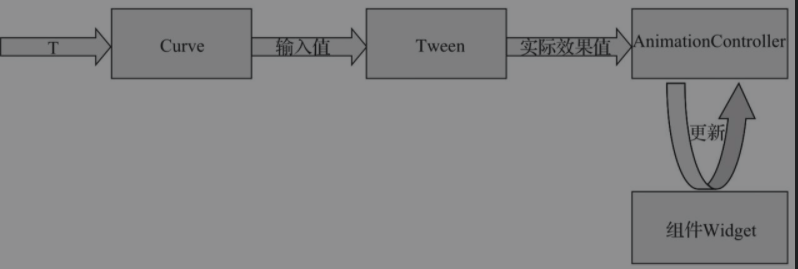

# 基本概念

## 帧

帧就是影像动画中最小单位的单幅影像画面，一帧就是一幅静止的画面。比如我们看到的电影胶片中的每一格即为一帧。

帧又分为**关键帧**和**过渡帧**，如下所示：

- 关键帧：指角色或者物体运动或变化中的关键动作所处的那一帧。
- 过渡帧：关键帧与关键帧之间的其他画面，也叫作中间帧。

## FPS

FPS（Frame Per Second）即每秒显示帧的数量。电影每秒播放24帧，即帧率为24FPS

## 插值器/估值器

为了使得动画呈现丰富的动画效果，就需要使用非线性动画，插值器与估值器可以解决这个问题。

概念如下所示：

- **插值器**：设置属性值从初始值过渡到结束值的**变化规律**，如匀速、加速及减速等，即**确定了动画效果变化的模式**，如匀速变化、加速变化等，主要应用于**实现非线性动画效果**。
- **估值器**：设置属性值从初始值过渡到结束值的变化**具体数值**。估值器的作用是**协助插值器实现非线性运动的动画效果**。

## Flutter中的动画类型

- **补间（Tween）动画**：定义开始点、结束点、时间和速度等参数，然后由框架自动计算如何从开始点到达结束点。
- **基于物理的动画**：模拟真实世界的行为。例如，当你掷球时，球在何处落地，取决于抛球速度有多快、球有多重、距离地面有多远。

# 基础概念相关类

## Animation：Flutter中动画的核心类。

Animation是Flutter中动画的**基类**。它是一个**抽象类**（abstract），所以不能直接创建其对象来使用动画。Animation具有以下特性：

- Animation对象知道动画的当前状态（例如，它是开始、停止还是向前或向后移动），但它不知道屏幕上显示的内容。
- Flutter中的Animation对象是一个在一段时间内依次生成一个区间之间值的类。Animation对象的输出可以是线性的、曲线的，可以是一个步进函数或者任何其他可设计的映射。根据Animation对象的控制方式，动画可以反向运行，甚至可以在中间切换方向。
- Animation还可以生成除double之外的其他类型值，如Animation<Color>或Animation<Size>。
- Animation对象有状态，可以通过访问其value属性获取动画的当前值。
- Animation对象本身和UI渲染没有任何关系。

## AnimationController：动画管理类。

AnimationController是一个特殊的Animation对象，继承自Animation，因此可以在需要Animation对象的任何地方使用它。默认情况下，AnimationController在给定的持续时间内线性生成从0.0到1.0的值。在不使用AnimationController的时候需要dispose处理，否则会造成资源的泄漏。

创建对象：

```dart
AnimationController(
	duration: const Duration(seconds: 2),
	vsync: this
)
```

第一个参数duration是动画执行的时间，第二个参数vsync用于防止动画离屏之后继续消耗资源。

vsync对象会绑定动画的定时器到一个可视的Widget，所以当Widget不显示时，动画定时器将会暂停，当Widget再次显示时，动画定时器重新恢复执行，这样就可以避免动画相关UI不在当前屏幕时消耗资源。

如果要使用自定义的State对象作为vsync，请包含TickerProviderStateMixin.

```dart
class MaskAnimation extends StatefulWidget {
  @override
  _MaskAnimation createState()=> _MaskAnimation();
}

class _MaskAnimation extends State<MaskAnimation> with TickerProviderStateMixin {}
```

TickerProvider类，其主要作用是获取每一帧刷新的通知，作用相当于给动画添加了一个动起来的引擎.

AnimationController提供了几个常用的方法:

```
// 开始动画，从开始值到结束值
TickerFuture forward({double from}){}
// 反向动画
TickerFuture reverse({double from}){}
// 重复动画
TickerFuture repeat({double min, double max, Duration period})
// 使用阻尼效果驱动动画
TickerFuture fling({double velocity: 1.0}){}
// 停止动画
void stop({bool canceled: true})
// 释放此对象的资源
void dispose(){}
```


## CurvedAnimation：用于定义非线性曲线动画。

将动画过程定义为一个非线性曲线，属于Animation<double>类型

## Tween：补间对象，用于计算动画使用的数据范围之间的插值。

Tween继承自Animatable<T>，而不是继承自Animation<T>。Animatable与Animation相似，不是必须输出double值。例如，ColorTween指定两种颜色之间的过渡

## Listeners和StatusListeners：用于监听动画状态改变。

Animation对象有Listeners和StatusListeners，用addListener来进行动画监听，用addStatus-Listener进行动画状态添加监听。只要动画的值发生变化，就会调用监听器。我们通常可用调用setState将动画状态重置。动画开始、结束、前进或后退时调用StatusListener.

下面是Flutter提供的动画的监听方法。

```dart
// 动画添加监听
void addListener(VoidCallback listener);
// 动画移除监听
void removeListener(VoidCallback listener);
// 动画状态添加监听
void addStatusListener(AnimationStatusListener listener);
// 动画状态移除监听
void removeStatusListener(AnimationStatusListener listener);
```

动画状态

```
enum AnimationStatus {
	// 动画在开始时停止
	dismissed,
	// 动画从开始状态执行到结束状态
	forward,
	// 动画反向执行，从结束状态到开始状态
	reverse,
	// 动画执行完成
	completed,
}
```

## 动画控制流程

当我们理解了插值器（Curve）、估值器（Tween）以及Ticker回调的原理后，就可以理出动画控制（AnimationController）大致的工作流程。

插值器根据时间产生的值作为输入，提供给估值器，产生动画的实际效果值，结合Ticker的回调，渲染出当前动画值的图像。这也是补间动画的工作原理

