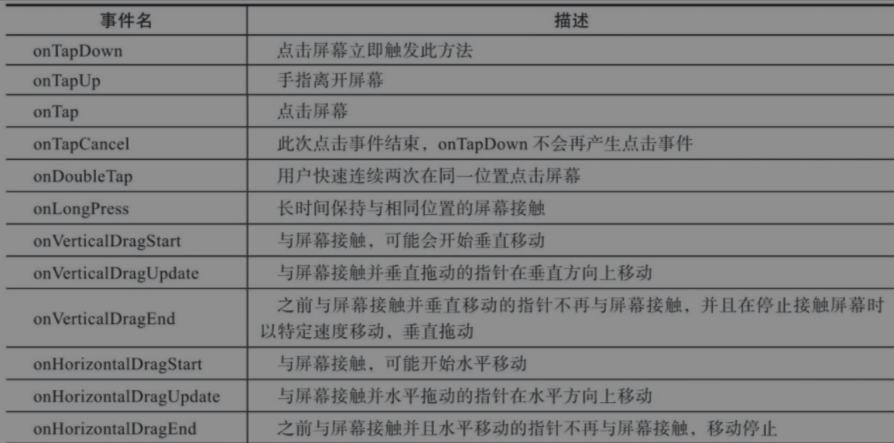
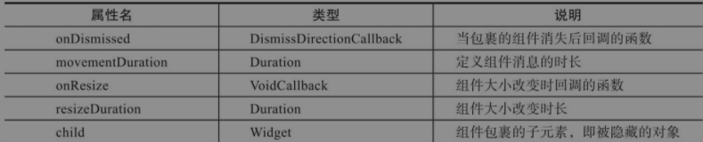

Flutter中提供的手势检测组件为`GestureDetector`

分两层：

第一层：**触摸原事件（指针）**，有四种事件类型：

- `PointerDownEvent`: 用户与屏幕接触产生了联系
- `PointerMoveEvent`: 手指从一个位置移动到另一个位置上
- `PointerUpEvent`：用户已停止触摸屏幕
- `PointerCancelEvent`：此指针的输入不再指向此应用程序

第二层：**可以检测到的手势**，主要分为三类：**轻击**、**拖放**、**缩放**

# GestureDetector手势检测

可以检测的内容包括：点击、双击、长按、垂直拖动、水平拖动



```dart
 Widget build(BuildContext context) {
    // 把被触摸的组件放在GestureDetector中
    return new GestureDetector(
      onTap: () {
        // 底部消息提示
        final snackBar = new SnackBar(content: new Text('你已按下'));
        Scaffold.of(context).showSnackBar(snackBar);
      },
      // 添加容器接收触摸动作
      child: new Container(
        padding: new EdgeInsets.all(12),
        decoration: new BoxDecoration(
          color: Theme.of(context).buttonColor,
          borderRadius: new BorderRadius.circular(10)
        ),
        child: Text('测试按钮'),
      )
    );
  }
}
```

# Dismsissble 滑动删除



