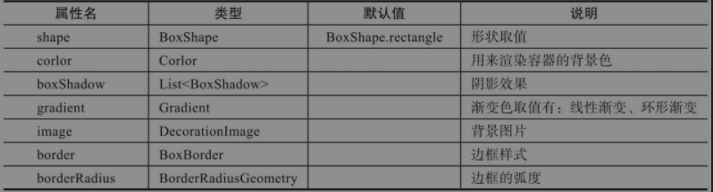
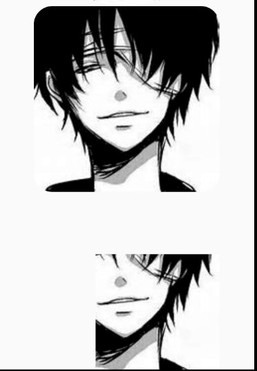
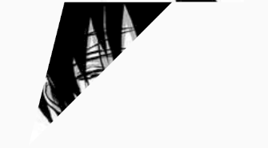
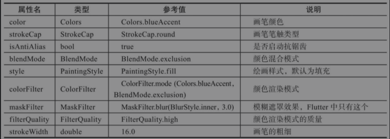

## Opencity(透明度处理)

注意：opacity设置的是**不透明度**

## DecorateBox(装饰盒子)



### 背景图效果

只需给image属性指定一个DecorationImage对象即可。

```dart
Container(
            width: 300,
            height: 300,
            decoration: BoxDecoration(
              color: Colors.grey,
              image: DecorationImage(
                image: ExactAssetImage('assets/images/1.jpeg'),
                fit: BoxFit.none,
              )
            ),// todo
            child: Text('这是一个背景图片', style: TextStyle(fontSize: 36, fontWeight: FontWeight.bold),),
          )
```

### 边框圆角处理

`border: Border.all(color: Colors.grey, width: 4),`

其中`EdgeInsets`支持多个自定义方法：

- `EdgeInsets.all()`: 所有方向
- `EdgeInsets.only(left, right, top, bootom)`: 选择方向
- `EdgeInsets.symmetric(vertical, horizontal)`: 自定义垂直、水平方向边框
- `EdgeInsets.fromWindowPadding(ui.WindowPadding padding, double devicePixcePixelRatio)`: 根据机型屏幕尺寸定义

### 边框阴影处理

通过`DecoratedBox`的`BoxShadow`实现。

```dart
		Container(
            width: 300,
            height: 300,
            decoration: BoxDecoration(
                color: Colors.white,
                boxShadow: <BoxShadow>[
                  BoxShadow(
                    color: Colors.grey, // 阴影颜色
                    blurRadius: 8, // 模糊值
                    spreadRadius: 8, // 扩展阴影
                    offset: Offset(-1, 1) // x/y方向偏移
                  )
                ],
            )
```

### 渐变处理

两种方式：一种是`LinearGradient`线性渐变，另一种是`RadialGradient`环形渐变。

`LinearGradient`参数：

- begin：起始偏移量
- end：终止偏移量
- colors：渐变颜色数据集

```dart
		decoration: BoxDecoration(
              gradient: LinearGradient(
                begin: const FractionalOffset(0.5, 0), // 起始偏移量
                end: const FractionalOffset(1, 1), // 终止偏移量
                colors: <Color>[
                  Colors.red,
                  Colors.blue,
                  Colors.green,
                  Colors.grey,
                ]
              ),
            ),
```


`RadialGradient`:环形渐变

```
            decoration: BoxDecoration(
              gradient: RadialGradient(
                  center: const Alignment(0, 0), // 0 0 代表中央
                  radius: 0.5, // 圆形半径
                  colors: <Color>[
                    Colors.red,
                    Colors.blue,
                    Colors.green,
                    Colors.grey,
                  ]),
            ),
```

# RotatedBox(旋转盒子)

旋转的度数以90度为单位，quarterTurns为3时，表示旋转了270度。


# Clip(剪裁处理)


## ClipOval(圆形剪裁)

```
		Center(
            child: ClipOval(
              // 固定大小
              child: SizedBox(
                width: 300,
                height: 300,
                child: Image.asset('assets/images/1.jpeg', fit: BoxFit.fill,),
              ),
            ),
          ),
```


## ClipRRect(圆角矩形裁剪)

```dart
		Center(
            child: ClipRRect(
              borderRadius: BorderRadius.all(
                // 圆角弧度
                Radius.circular(30),
              ),
              // 固定大小
              child: SizedBox(
                width: 300,
                height: 300,
                child: Image.asset('assets/images/1.jpeg', fit: BoxFit.fill,),
              ),
            ),
          ),
```

## ClipRect(矩形裁剪)

需要自定义clipper属性才能使用。自定义clipper需要继承CustomClipper类，并且需要重写getClip和shouldReclip两个方法。

```dart
          Center(
            child: ClipRect(
              clipper: RectClip(),
              // 固定大小
              child: SizedBox(
                width: 300,
                height: 300,
                child: Image.asset('assets/images/1.jpeg', fit: BoxFit.fill,),
              ),
            ),
          ),

class RectClip extends CustomClipper<Rect> {
  // 重写获取剪裁范围
  @override
  Rect getClip(Size size) {
    return Rect.fromLTRB(100, 100, size.width, size.height);
  }

  // 重写是否需要剪裁
  @override
  bool shouldReclip(CustomClipper<Rect> oldClipper) {
    return true;
  }
}
```



## ClipPath(路径裁剪)

这个组件采用了矢量路径path，所以可以把组件裁剪为任意类型的形状：三角形、矩形、星形、多边形。

自定义clipper需要继承CustomClipper类，并且需要重写getClip和shouldReclip两个方法。

```dart
// 自定义三角形Clipper，类型为Path
class TriangleCliper extends CustomClipper<Path> {
  @override
  getClip(Size size) {
    Path path = Path();
    path.moveTo(50, 0); // 移动至起始点
    path.lineTo(0, 200); // 开始画线，从(50,0)到(0,200)
    path.lineTo(200, 0); // 画线，从(0,200)到(200,0)
    path.close();
    return path;
  }

  @override
  bool shouldReclip(CustomClipper oldClipper) {
    return true;
  }
}

		Center(
            child: ClipPath(
              clipper: TriangleCliper(),
              // 固定大小
              child: SizedBox(
                width: 300,
                height: 300,
                child: Image.asset('assets/images/1.jpeg', fit: BoxFit.fill,),
              ),
            ),
          ),
```




# 画布(Canvas)与画笔(Paint)

Canvas相关方法：

- drawLine(): 画直线
- drawCircle(): 画圆
- drawOval(): 画椭圆
- drawRect(): 画矩形
- drawPoints(): 画点
- drawArc(): 画圆弧

Paint相关属性：



## 绘制直线

```dart

class LinerPainter extends CustomPainter {
  // 定义画笔
  Paint _paint = Paint()
    ..color = Colors.green
    ..strokeCap = StrokeCap.round // 画笔笔触类型
    ..isAntiAlias = true // 是否启动抗锯齿
    ..blendMode = BlendMode.exclusion // 颜色混合模式
    ..style = PaintingStyle.fill // 绘画风格
    ..colorFilter = ColorFilter.mode(Colors.blueAccent, BlendMode.exclusion) // 颜色渲染模式
    ..maskFilter = MaskFilter.blur(BlurStyle.inner, 3) // 模糊遮罩效果
    ..filterQuality = FilterQuality.high // 颜色渲染模式的质量
    ..strokeWidth = 16;
  // 重写绘制方法
  @override
  void paint(Canvas canvas, Size size) {
    // 绘制直线
    canvas.drawLine(Offset(20, 20), Offset(300, 20), _paint);
  }

  // 重写是否需要绘制
  @override
  bool shouldRepaint(CustomPainter oldDelegate) {
    return false;
  }
}

		child: CustomPaint(
              painter: LinerPainter(),
              child: Center(
                child: Text(
                  '绘制直线',
                  style: TextStyle(
                    fontSize: 38,
                    fontWeight: FontWeight.w600,
                    color: Colors.black,
                  ),
                ),
              )
            ),
```

## 绘制圆

```dart
// 重写绘制方法
  @override
  void paint(Canvas canvas, Size size) {
    // 绘制直线
    canvas.drawCircle(Offset(200, 150), 150, _paint);
  }
```

## 绘制椭圆

```dart
  // 重写绘制方法
  @override
  void paint(Canvas canvas, Size size) {
    Rect rect = Rect.fromPoints(Offset(80, 200), Offset(300, 300));
    canvas.drawOval(rect, _paint);
  }
```

## 绘制圆形矩角

```dart
  @override
  void paint(Canvas canvas, Size size) {
    Rect rect = Rect.fromCircle(center: Offset(200, 200), radius: 100);
    // 根据矩形创建
    RRect rRect = RRect.fromRectAndRadius(rect, Radius.circular(200));
    canvas.drawOval(rRect, _paint);
  }
```

## 绘制嵌套矩形

```dart
// 嵌套矩形
  @override
  void paint(Canvas canvas, Size size) {
    Rect rect1 = Rect.fromCircle(center: Offset(150, 150), radius: 80);
    Rect rect2 = Rect.fromCircle(center: Offset(150, 150), radius: 40);
    // 根据矩形创建
    RRect rRect1 = RRect.fromRectAndRadius(rect1, Radius.circular(200));
    RRect rRect2 = RRect.fromRectAndRadius(rect2, Radius.circular(200));
    canvas.drawDRRect(rRect1, rRect2, _paint);
  }
```

## 绘制多个点

分为点、隔点连接线、相邻连接线

```dart
// 点
  @override
  void paint(Canvas canvas, Size size) {
    canvas.drawPoints(
        PointMode.points,
        [
          Offset(50, 60),
          Offset(40, 90),
          Offset(100, 100),
          Offset(300, 350),
        ],
        _paint
    );
  }
```

## 绘制圆弧

```dart
  @override
  void paint(Canvas canvas, Size size) {
    const PI = 3.141592653;
    Rect rect1 = Rect.fromCircle(center: Offset(100, 0), radius: 80);
    canvas.drawArc(rect1, 0, PI/2, true, _paint);

    Rect rect2 = Rect.fromCircle(center: Offset(100, 0), radius: 80);
    canvas.drawArc(rect2, 0, PI/2, true, _paint);
  }
```

## 绘制路线

```dart
  @override
  void paint(Canvas canvas, Size size) {
    Path path = Path()..moveTo(100, 100);
    path.lineTo(200, 300);
    path.lineTo(100, 200);
    path.lineTo(150, 300);
    path.lineTo(300, 300);
    canvas.drawPath(path, _paint)
  }
```

