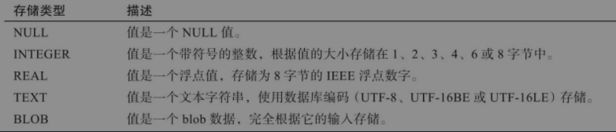

# 基本路由

页面之间通过导航器`Navigator`组件来管理。导航器管理一组路由`Router`对象，并采用**堆栈**方法进行管理。

- `Navigator.push`将一个元素插入堆栈的顶部。比如在Screen1中push一个页面Screen2，将Screen2的压到堆栈的顶部。
- `Navigator.pop`将堆栈的顶部元素进行删除，回退到上一个界面。

## 页面跳转基本操作

关键代码

```dart
// .....
child: RaisedButton(
    child: Text('查看商品详情页面'),
    onPressed: (){
        // 压栈处理，路由至第二个页面
        Navigator.push(context, MaterialPageRoute(builder: (context)=> SecondScreen()));
    },
),

// ..............
child: RaisedButton(
    child: Text('返回页面'),
    onPressed: (){
        // 出栈处理，返回至第一个页面
        Navigator.pop(context);
    },
),
```

## 页面跳转并发送数据

关键代码

```dart
// ...............
// 点击跳转至商品详情页，传入Product对象
onTap: (){
    Navigator.push(context, MaterialPageRoute(
        builder: (context) => ProductDetail(
            product: products[index]
        )
    ));
},
// ...
// 商品详情页
class ProductDetail extends StatelessWidget {
  final Product product;
  // 构造方法，将传入的商品数据赋值给product
  ProductDetail({Key key, @required this.product}): super(key: key);

  @override
  Widget build(BuildContext context) {
    return Scaffold(
      appBar: AppBar(title: Text('${product.title}'),),
      body: Padding(
        padding: EdgeInsets.all(16),
        child: Text('${product.description}'),
      ),
    );
  }
}
```


## 页面跳转并返回数据

关键代码

```dart
// 跳转按钮
class RouteButton extends StatelessWidget{
  // 路由到第二个页面
  _navigateToSecondPage(BuildContext context) async {
    // 压栈操作等待页面返回
    final result = await Navigator.push(context, MaterialPageRoute(
        builder: (context) => SecondScreen()
    ));
    // 读取返回内容
    Scaffold.of(context).showSnackBar(
        SnackBar(content: Text('$result'),)
    );
  }

  @override
  Widget build(BuildContext context) {
    return RaisedButton(
      onPressed: () {
        _navigateToSecondPage(context);
      },
      child: Text('跳转到第二个页面'),
    );
  }
}
// .....
child: RaisedButton(
    onPressed: () {
        // 出栈带上参数，返回上一个页面
        Navigator.pop(context, 'hi 小兰');
    },
    child: Text('hi 小兰'),
),
```

# Fluro企业级路由

[官方地址](https://pub.dev/packages/fluro)

1. 在pubspec.yaml中添加Fluro库

   ```
   dependencies:
    fluro: "^1.6.3"
   ```

2. 定义路由

3. 定义路由函数

4. 用类实现页面

5. 定义主类，创建路由对象，指定主页

# key-value存储

iOS平台中的`NSUserDefaults`、安卓平台的`SharedPre-ferences`

## shared_preferences

1. 引入插件

   在pubspec.yaml中添加插件

   ```yaml
   dependencies:
     shared_preferences: ^0.5.3+4
   ```

完整代码

```dart
import 'package:flutter/material.dart';
import 'package:shared_preferences/shared_preferences.dart';

void main()=>runApp(MyApp());


class MyApp extends StatelessWidget {
  @override
  Widget build(BuildContext context) {
    return MaterialApp(
      title: 'PersistentDemo',
      theme: ThemeData(
        primaryColor: Colors.blue,
      ),
      home: PersistentDemo(),
    );
  }
}

// 本地存储
class PersistentDemo extends StatefulWidget {
  @override
  State<StatefulWidget> createState() => PersistentDemoState();
}

class PersistentDemoState extends State<PersistentDemo> {
  // 实例化本地存储对象
  Future<SharedPreferences> _prefs = SharedPreferences.getInstance();
  // 昵称 选择的语言
  var controller = TextEditingController();
  bool value_dart = false;
  bool value_js = false;
  bool value_java = false;

  @override
  void initState() {
    super.initState();
    initFromCache();
  }

  @override
  void dispose() {
    super.dispose();
    controller = null;
  }

  // 从缓存中获取信息
  void initFromCache() async {
    final SharedPreferences prefs = await _prefs;
    final value_nickname = prefs.getString("key_nickname");
    final value_dart = prefs.getBool("key_dart");
    final value_js = prefs.getBool("key_js");
    final value_java = prefs.getBool("key_java");
    // 获取到缓存中的值后，使用setState更新界面信息
    setState(() {
      controller.text = (value_nickname == null ? "": value_nickname);
      this.value_dart = (value_dart == null ? false: value_dart);
      this.value_js = (value_js == null ? false: value_js);
      this.value_java = (value_java == null? false: value_java);
    });
  }

  // 保存界面的输入选择信息
  void saveInfo(String value_nickname) async {
    final SharedPreferences prefs = await _prefs;
    prefs.setString("key_nickname", value_nickname);
    prefs.setBool("key_dart", value_dart);
    prefs.setBool("key_js", value_js);
    prefs.setBool("key_java", value_java);
  }

  @override
  Widget build(BuildContext context) {
    return Scaffold(
      appBar: AppBar(title: Text('SharedPreferences示例'),),
      body: Container(
        padding: EdgeInsets.all(5),
        child: Column(
          crossAxisAlignment: CrossAxisAlignment.center,
          children: <Widget>[
            TextField(
              controller: controller,
              decoration: InputDecoration(
                labelText: '昵称',
                hintText: '请输入名称',
              ),
            ),
            Text('你喜欢的变成语言'),
            Row(
              mainAxisAlignment: MainAxisAlignment.spaceBetween,
              children: <Widget>[
                Text('Dart'),
                Switch(value: value_dart, onChanged: (isChanged) {
                  setState(() {
                    this.value_dart = isChanged;
                  });
                })
              ],
            ),
            Row(
              mainAxisAlignment: MainAxisAlignment.spaceBetween,
              children: <Widget>[
                Text('Js'),
                Switch(value: value_js, onChanged: (isChanged) {
                  setState(() {
                    this.value_js = isChanged;
                  });
                })
              ],
            ),
            Row(
              mainAxisAlignment: MainAxisAlignment.spaceBetween,
              children: <Widget>[
                Text('Java'),
                Switch(value: value_java, onChanged: (isChanged) {
                  setState(() {
                    this.value_java = isChanged;
                  });
                })
              ],
            ),
            MaterialButton(
              child: Text('保存'),
              onPressed: () {
                saveInfo(controller.text);
              },
            )
          ],
        ),
      ),
    );
  }
}
```

## 原理

主要是通过Channel与原生平台进行交互，通过iOS平台的NSUserDefaults、安卓平台的SharedPreferences来实现具体数据存取操作。

# 文件存储

添加插件

```dart
dependencies:
  path_provider: ^0.4.1
```

完整代码

```dart
import 'dart:io';
import 'dart:async';
import 'package:flutter/material.dart';
import 'package:path_provider/path_provider.dart';

void main() => runApp(
  MaterialApp(
    home: LogInfo(),
  )
);

class LogInfo extends StatefulWidget {
  @override
  State<StatefulWidget> createState() => LogInfoState();
}

class LogInfoState extends State<LogInfo> {
  int log_id = 0;
  String log_info = "";
  File file;

  @override
  void initState() {
    super.initState();
    // 读取日志信息
    readLogInfo().then((String value) {
      setState(() {
        log_info = value;
      });
    });
  }

  // 获取文件对象
  Future<File> getFile() async {
    // 获取文件所在路径
    String dir = (await getApplicationDocumentsDirectory()).path;
    // 创建文件
    if (file == null) {
      return File('$dir/log.txt');
    }
    return file;
  }

  // 读取日志信息
  Future<String> readLogInfo() async {
    try {
      File file = await getFile();
      String contents = await file.readAsString();
      return contents;
    } on FileSystemException {
      return "";
    }
  }

  // 写入日志
  Future<Null> writeLog() async {
    // 增加日志号
    setState(() {
      log_id ++;
    });
    await (await getFile()).writeAsString('日志信息：$log_id\n', mode: FileMode.append);
  }

  @override
  Widget build(BuildContext context) {
    return Scaffold(
      appBar: AppBar(title: Text('文件存储示例'),),
      body: Center(
        child: Text('$log_info'),
      ),
      floatingActionButton: FloatingActionButton(
        onPressed: writeLog,
        tooltip: '写入日志',
        child: Icon(Icons.add),
      ),
    );
  }
}
```

# Sqflite

Sqf lite是一款轻量级的**关系型数据库**，类似SQLite，支持iOS和Android，适用于存储数据库、表类型的数据。

具体特性如下：

- 支持事务和批处理。
- 支持打开期间进行自动版本管理。
- 支持插入/查询/更新/删除操作。
- 支持在iOS和Android上的后台线程中执行数据库操作。



配置插件

```
dependencies:
  sqflite: ^1.1.6+4
```

创建实体类`client.dart`

```dart
import 'dart:core';

class Client {
  int id;
  String name;
  int age;
  bool sex;
  Client(this.id, this.name, this.age, this.sex);

  // 将Json转换成数据类型
  factory Client.fromMap(Map<String, dynamic> json) => Client(
      json["id"],
      json["name"],
      json["age"],
      json["sex"] == 1,
  );

  // 将数据模型转换成JSON
  Map<String, dynamic> toMap() => {
    "id": id,
    "name": name,
    "age": age,
    "sex": sex,
  };
}
```

数据库操作`database.dart`

```dart
import 'dart:io';
import 'package:path_provider/path_provider.dart';
import 'package:sqflite/sqflite.dart';
import 'client.dart';
import 'dart:async';
import 'package:path/path.dart';

class DBProvider {
  DBProvider._();
  static final DBProvider db = DBProvider._();
  Database _database;
  // 获取database对象
  Future<Database> get database async {
    // 使用单例模式创建
    if (_database != null) {
      return _database;
    }
    _database = await initDB();
    return _database;
  }
  // 初始化数据库
  initDB() async {
    // 获取文档目录对象
    Directory documentsDirectory = await getApplicationDocumentsDirectory();
    // 获取默认数据库位置
    String path = join(documentsDirectory.path, "client.db");
    // 打开数据库，传入路径、版本号、打开完成回调函数
    return await openDatabase(path, version: 1, onOpen: (db){},
        onCreate: (Database db, int version) async {
          await db.execute("CREATE TABLE Client ("
              "id INTEGER PRIMARY KEY,"
              "name TEXT,"
              "age INTEGER,"
              "sex BIT"
          ")"
        );
    });
  }
  // 新增Client
  insertClient(Client newClient) async {
    final db = await database;
    // 获取表中最大id再加1作为新id
    var table = await db.rawQuery("SELECT MAX(id)+1 as id FROM Client");
    int id = table.first["id"];
    var raw = await db.rawInsert(
      "INSERT INTO Client (id, name, age, sex) VALUES (?,?,?,?)",
      [id, newClient.name, newClient.age, newClient.sex]
    );
  }
  // 修改性别
  updateSex(Client client) async {
    final db = await database;
    Client newClient = Client(
      client.id,
      client.name,
      client.age,
      !client.sex,
    );
    var res = await db.update("Client", newClient.toMap(), where: "id=?",
      whereArgs: [client.id]);
    return res;
  }
  // 根据ID读取client
  getClient(int id) async {
    final db = await database;
    var res = await db.query("Client", where: "id=?", whereArgs: [id]);
    return res.isNotEmpty? Client.fromMap(res.first) : null;
  }

  // 获取所有Client
  Future<List<Client>> getAllClient() async {
    final db = await database;
    var res = await db.query("Client");
    List<Client> list = res.isNotEmpty ? res.map((c) => Client.fromMap(c)).toList() : [];
    return list;
  }

  // 根据Id删除Client
  deleteClient(int id) async {
    final db = await database;
    return db.delete("Client", where: "id=?", whereArgs: [id]);
  }
  // 删除所有
  deleteAll() async {
    final db = await database;
    db.rawDelete("Delete * from Client");
  }
}
```

控制实体

```dart
import 'client.dart';
import 'database.dart';
import 'package:flutter/material.dart';
import 'dart:math' as math;

void main() => runApp(MaterialApp(home: MyApp(),));

class MyApp extends StatefulWidget {
  @override
  _MyAppState createState() => _MyAppState();
}

class _MyAppState extends State<MyApp> {
  // 测试数据
  List<Client> clients = [
    Client(1, "张三", 22, false),
    Client(2, "李四", 20, true),
    Client(3, "王五", 23, false),
  ];
  @override
  Widget build(BuildContext context) {
    return Scaffold(
      appBar: AppBar(title: Text(('Sqflite示例')),),
      body: FutureBuilder<List<Client>>(
        // 获取所有Client
        future: DBProvider.db.getAllClient(),
        builder: (BuildContext context, AsyncSnapshot<List<Client>> snapshot) {
          // 如果有数据用列表展示
          if (snapshot.hasData) {
            return ListView.builder(
              itemCount: snapshot.data.length,
              itemBuilder: (BuildContext context, int index) {
                Client item = snapshot.data[index];
                // 滑动删除组件
                return Dismissible(
                  key: UniqueKey(),
                  background: Container(color: Colors.red,),
                  onDismissed: (direction) {
                    DBProvider.db.deleteClient(item.id);
                  },
                  child: ListTile(
                    title: Text(item.name.toString()),
                    leading: Text(item.id.toString()),
                    trailing: Checkbox(
                      onChanged: (bool value) {
                        // 更新性别
                        DBProvider.db.updateSex(item);
                        setState(() {});
                      },
                      value: item.sex,
                    ),
                  ),
                );
              }
            );
          }else {
            // 没有数据显示缓冲动画
            return Center(
              child: CircularProgressIndicator(),
            );
          }
        }),
      floatingActionButton: FloatingActionButton(
        child: Icon(Icons.add),
        onPressed: () async {
          // 随机选择一条数据
          Client rnd = clients[math.Random().nextInt(clients.length)];
          // 插入数据
          await DBProvider.db.insertClient(rnd);
          setState(() {});
        },
      ),
    );
  }
}
```

