# 风格组件/材料组件

Material Design是谷歌推出的全新设计语言，旨在为手机、平板电脑、台式机和其他平台提供更一致、更广泛的外观和感觉。

# 风格组件的说明

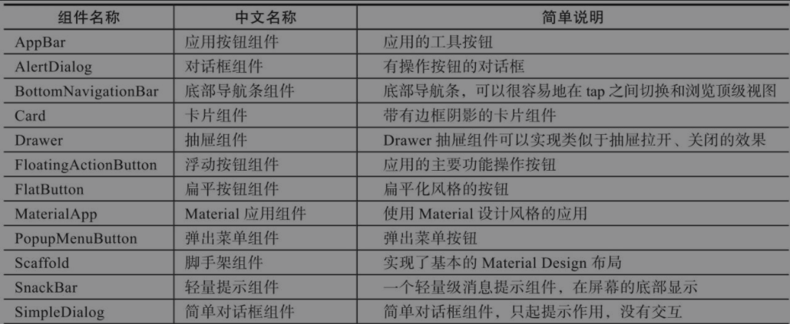

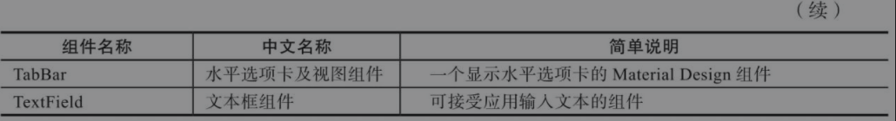

# App结构和导航组件

## MaterialApp

**主组件。**一个完整的Flutter从MaterialApp启动。

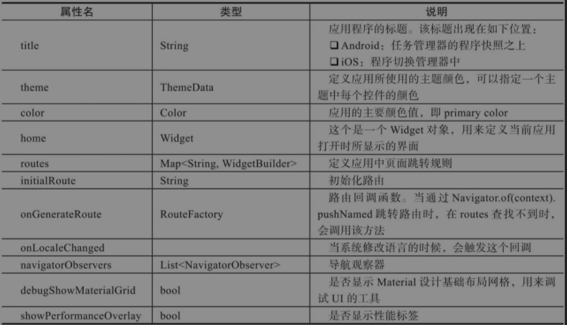

```dart
class MyApp extends StatelessWidget {
	@override
	Widget build (BuildContext context) {
		return MaterialApp(
			// 设置首页
			home: MyHomePage(),
			title: 'MaterialApp示例'
		)
	}
}

class MyHomePage extends StatefulWidget {
	//..........
}
```

## 路由处理

`routers`对象是一个`Map<String, WidgetBuilder>`。

当使用`Navigator.pushNamed`来路由的时候，会在`routers`中查找路由的名字，然后使用对应的`WidgetBuilder`来构建一个带页面切换动画的`MaterialPageRouter`

```dart
Navigator.pushNamed(context, '/somePage')
```

在`MaterialApp`中初始化路由：

```dart
routes: {
	'/first': (BuildContext context) => FirstPage(),
	'/second': (BuildContext context) => SecondPage(),
},
initialRoute: '/first',
```

这些路由是**全局**的。

## 主题

```dart
MaterialApp(
	theme: ThemeData(
		//主题色
		primarySwatch: Color.blue,
	),
);
```

## Scaffold(脚手架)

Scaffold实现了基本的Material Design布局。

只要是在Material Design中定义过的单界面显示的布局组件原色，都可以使用Scaffold来绘制。

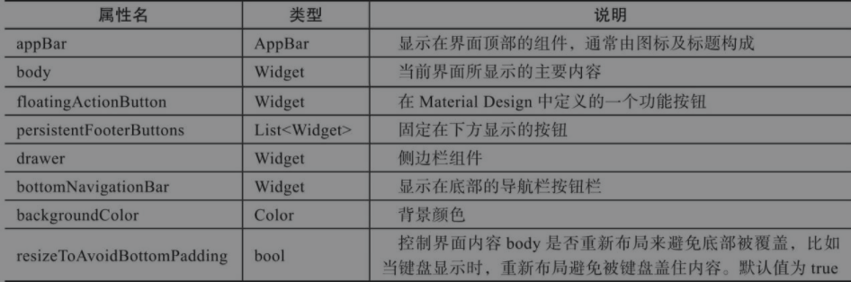

## 应用组件按钮

包括：AppBar和SliverAppBar.

两者都继承自StatefulWidget类。

区别在于AppBar的位置是固定在应用最上层的，而SliverAppBar是可以随内容滚动的。

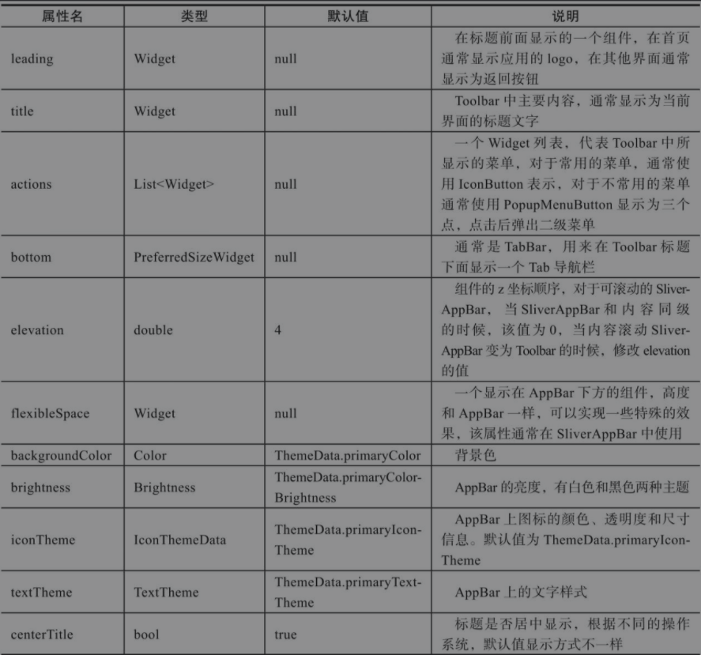

### AppBar组件布局图

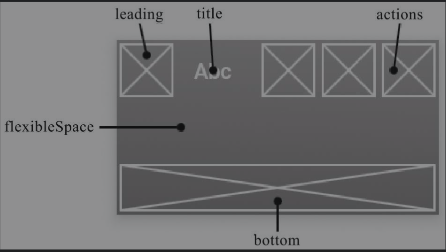

AppBar可以显示leading、title、actions等内容。

底部通常为TabBar选项卡

flexibleSpace显示在AppBar下方，高度和AppBar一样，可以实现一些特殊效果。

## BottomNavigationBar(底部导航条组件)

BottomNavigationBar可以很容易地在tap之间切换和浏览顶级视图。

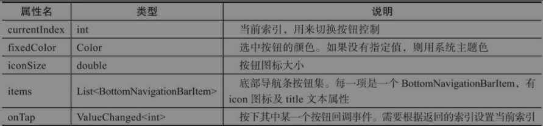

## TabBar(水平选项卡及视图组件)

TabBar通常需要配合Tab选项组件及TabBarView页面视图组件一起使用。

### TabBar组件常用属性

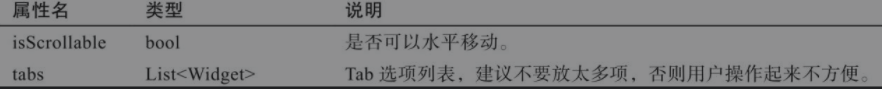

### Tab组件常用属性

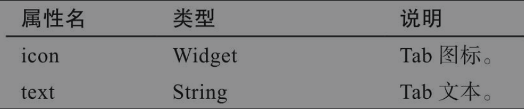

### TabBarView组件常用属性

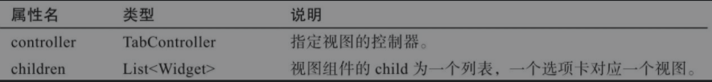

TabBar的选项卡按钮通常在应用页面上部。

管理TabBar和TabBarView的控制器：`DefaultTabController`，即连接上部tab与中间内容。

## Drawer(抽屉组件)

通常和`ListView`一起使用

### 常用

### 属性

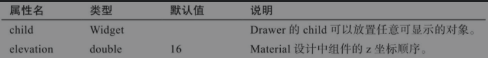

Drawer组件可以添加**头部效果**，可以用以下两个组件实现。

- DrawerHeader : 展示基本信息
- UserAccountDrawerHeader: 展示用户名、头像、Email等信息

### DrawerHeader组件属性及描述

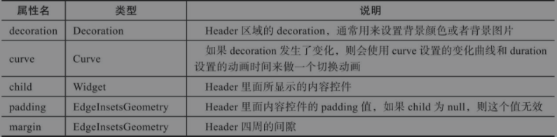

### UserAccountDrawerHeader组件属性及描述

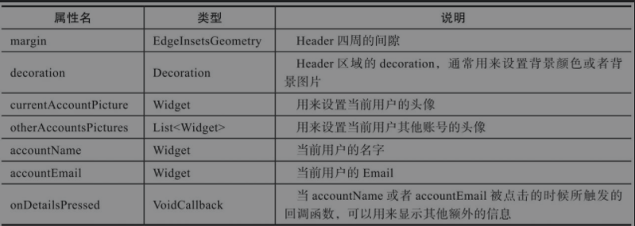

# 按钮和提示组件

## FloatingActionButton(按钮悬停组件)

`FloatingActionButton`对应一个**圆形图标按钮**，悬停在内容上。

`FloatingActionButton`常用于`Scaffold.floatingActionButton`字段，常用属性：

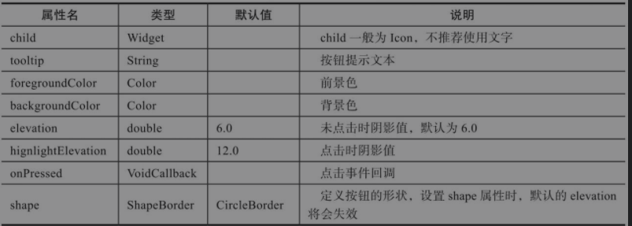

## FlatButton(扁平按钮组件)

`FlatButton`是一个扁平的按钮组件，点击时会生成阴影效果。

## PopupMenuButton(弹出菜单组件)

一般放在菜单右上角表示更多操作。

常用属性：

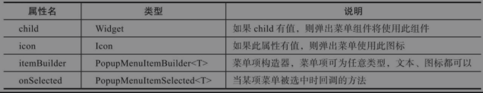

## SimpleDialog(简单对话组件)

用于设计对话框，可以显示附加的提示或操作。常用属性

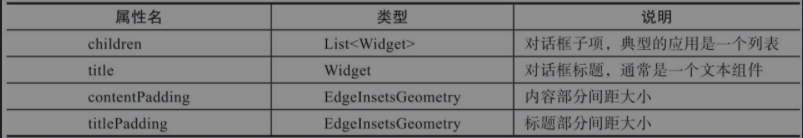

通常需要配合`SimpleDialogOption`组件一起使用。

一般需要通过某个动作来触发，所以对话框一般都封装在某个方法中，另外这个过程是**异步**的，所以需要加入`async/await`处理。

## AlertDialog(提示框组件)

不仅有提示内容，还有操作按钮，内容部分可以用`SimpleChildScrollView`进行包裹。组件属性：

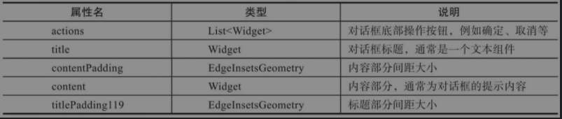

## SnackBar(轻量提示组件)

弹窗过几秒就会消失。

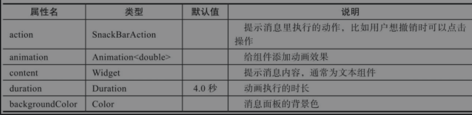

# 其他组件

## TextField(文本框组件)

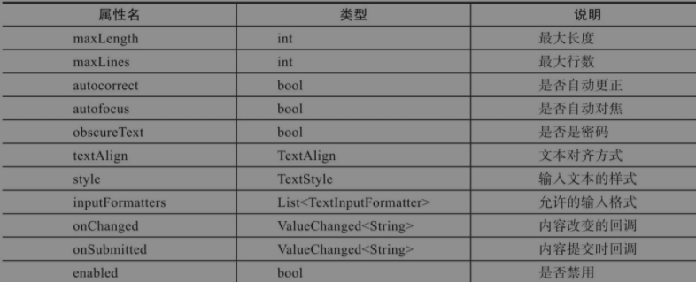

如果需要获取文本内容，不仅要有输入框，还要传递Controller给TextField,用来监听文本内容变化

```dart
// 添加文本编辑控制器，监听文本内容变化
final TextEditingController controller = TextEditingController();
controller.addListener(() { 
    print('输入内容为：${controller.text}');
});
..........
    body: Center(
        child: Padding(
            padding: const EdgeInsets.all(20),
            child: TextField(
                // 绑定controller
                controller: controller,
                // 内容更改时回调
                onChanged: (text) {
                    print('文本内容改变时回调 $text');
                },
                // 内容提交时回调
                onSubmitted: (text) {
                    print('文本内容提交时回调 $text');
                },
                enabled: true, // 是否禁用
                decoration: InputDecoration(
                    fillColor: Colors.grey.shade200,
                    filled: true,
                    helperText: '用户名',
                    prefixIcon: Icon(Icons.person),
                    suffixText: '请输入用户名',
                ),
            ),
        ),
    ),
```

## Card(卡片组件)

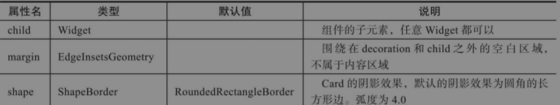

