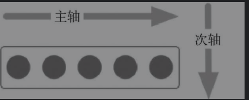
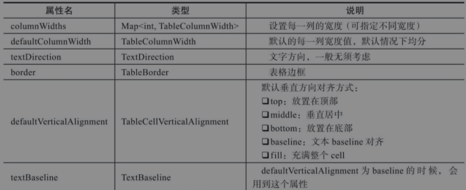

# 布局及装饰组件


# 基础布局处理

## Container(容器布局)

Container是一个Widget组合，包括绘制Widget、定位Widget、尺寸Widget


## Center(居中布局)

在center中，子元素位于水平和垂直方向的中间位置。

## Padding(填充布局)

padding用于填充容器与其子元素的间距。

margin处于容器与其他组件的间距。

## Align(对齐布局)

对齐组件，将组件按照指定方式对齐，并根据子组件的大小调整自己的大小。


## Row(水平布局)


**水平方向是主轴，垂直方向是次轴**




## Column(垂直布局)


**垂直方向是主轴，水平方向是次轴。**


## FittedBox(缩放布局)

包括**缩放**和**位置调整**

FittedBox会在自己的尺寸内缩放并调整child位置。

布局分两种情况：

- 如果外部有约束，则按照外部约束来调整自身尺寸，然后缩放调整child，按照指定的条件来进行布局
- 如果外部无约束，则与child的尺寸保持一致，指定的位置与缩放属性不起作用。

FittedBox有两个重要属性：

- fit：缩放的方式，默认为BoxFix.contain，child在FittedBox范围内尽可能放大（在保持宽高比的大前提下）
  - none：没有任何填充方式
  - fill：填满，不按照宽高比
  - cover：按原始尺寸填充，可能会超过容器范围（超过部分不显示）
  - fitwidth: 按宽填充整个容器
  - fitheight: 按高填充整个容器
  - scaleDown: 根据情况缩小范围
- alignment: 设置对齐方式，默认Align-ment.center，居中显示child

## Stack/Alignment

Stack组件的每一个子组件要么定位，要么不定位，定位的子组件使用Positioined组件包裹的。

Stack组件本身包含所有不定位的子组件，子组件根据alignment属性定位（默认左上角），然后根据定位的子组件的top、right、bottom和left属性将他们放到Stack组件上。


## Stack/Positioned

Positioned是用来定位的。


## IndexedStack

IndexedStack继承自Stack，作用是显示第index个child，其他child不显示。所以IndexedStack的尺寸永远和最大的子节点尺寸一致。由于IndexedStack是继承自Stack的，所以它只比Stack多一个index属性

## OverflowBox(溢出父容器显示)

子组件与父组件之间加一个OverflowBox，那么子组件就不会以父组件作为约束条件，而是以OverflowBox组件属性作为约束条件。


# 高宽处理

## SizedBox(设置具体尺寸)

SizedBox是一个特点大小的盒子，这个组件强制他的child有特定的宽度和高度。


## ConstrainedBox(限定最大最小宽度布局)

ConstrainedBox作用是限定child最大高度、最大宽度、最小高度、最小宽度


## LimitedBox(限定最大宽高)

与ConstrainedBox相比，没有限定最小宽高

## AspectRatio(调整宽高比)

AspectRatio首先会在布局限制条件允许范围内尽可能的扩展，Widget的高度由宽度和比率决定。类似BoxFix中的contain。

如果在满足所有限制条件后，没有找到可行的尺寸，AspectRatio会优先使用布局限制条件，而忽略所设置的比率。


## FractionallySizedBox(百分比布局)

根据现有空间来调整child，child中的尺寸数据不会生效。

如果设置了宽高因子，具体的宽高则根据现有宽高*因子，当因子大于1时，可能会超出父组件范围。

如果没有设置宽高因子，则填满可用区域。


容器间默认居中对齐，所以如果没有黄色容器，蓝色的左边溢出来的部分会被掩盖。

设置`alignment: Alignment.topLeft,`就不会有这个问题。

# 列表及表格布局

## ListView

对列表数据进行展示。


对长内容进行滚动展示

## GridView(网格布局)

多行多列


## Table




## Transform(矩阵转换)

对child进行平移、旋转、缩放等操作


## Baseline(基准线布局)

将所有元素底部放到同一条水平线上。


主要属性：


## Offstage(控制是否显示组件)

通过参数offstage来控制child是否显示。

```dart
Center(
    child: Offstage(
        offstage: offstate,
            child: Text(
                '这是哪',
                style: TextStyle(
                	fontSize: 36
                )
            ),
        ),
    )
),
```

## Wrap(按宽高自动换行布局)

Row与Column都是单行单列的，Wrap突破了这个限制。主轴上空间不足时，则向次轴扩展，适用于按宽度或者高度让child自动换行布局的场景。


