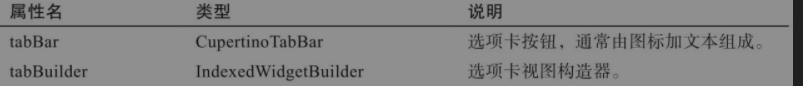
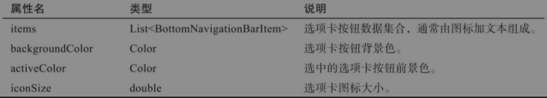
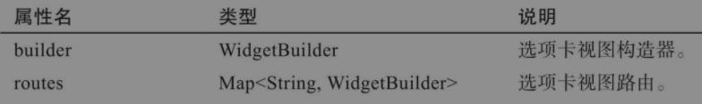
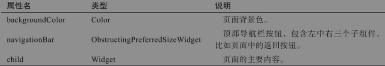
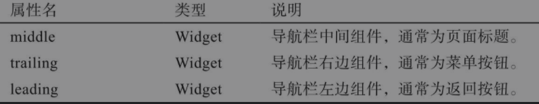
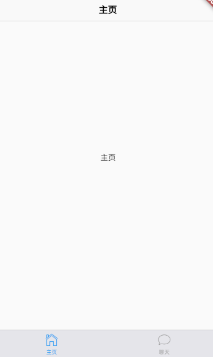

Cupertino风格组件即**IOS风格**组件，目前不如MaterialDesign风格组件丰富。

需要导包：`import 'package:flutter/cupertino.dart';`

## CupertinoActivityIndicator(加载指示器)

通常用来做**加载等待**。

## CupertinoAlertDialog(对话框组件)

IOS风格

material风格

## CupertinoButton(按钮组件)

## Cupertino(导航组件集)

### CupertinoTabScaffold

`CupertinoTabScaffold`为选项卡组件，将选项卡按钮和选项卡视图绑在一起。

### CupertinoTabBar

`CupertinoTabBar`为选项卡按钮组件，通常由`BottomNavigationBarItem组成，包含图片和文本。

### CupertinoTabView

`CupertinoTabView`为选项卡视图组件

### CupertinoPageScaffold

`CupertinoPageScaffold`为页面基本布局结构组件

### CupertinoNavigationBar

`CupertinoNavigationBar`为导航栏结构组件

